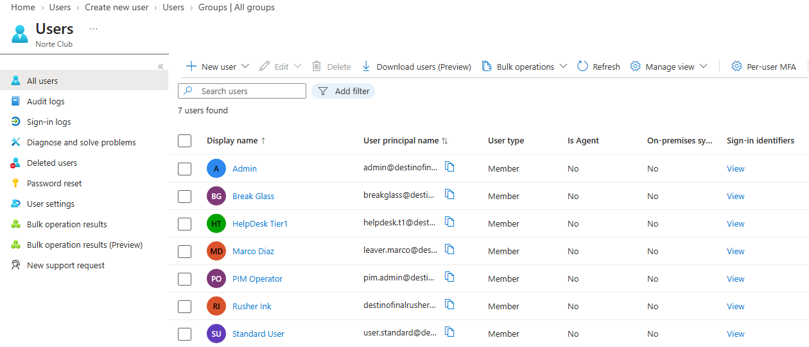
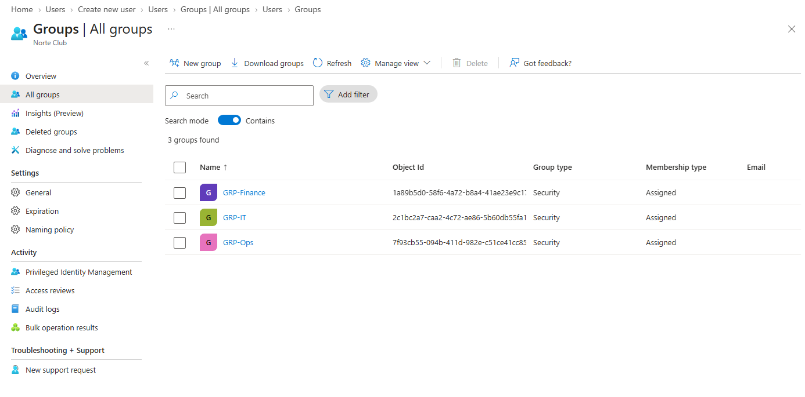

Write 01-identities.md for the Norte Club Entra lab. First person. Lab notebook. Under 400 words.

Facts:
- 27 Aug 2026. Norte Club. Entra P2.
- admin = daily Global Admin I use to build. breakglass = second Global Admin I do not use. I created breakglass because admin is not an emergency account.
- helpdesk.t1, pim.admin, user.standard, leaver.marco = no directory role on day 1
- Groups: GRP-Ops, GRP-Finance, GRP-IT. Security, Assigned, not role-assignable. Empty members.
- Why helpdesk is not standing GA: standing GA on a tier-1 account is blast radius if that mailbox gets phished. Same idea as Remitly — do not leave the powerful action on the account that gets hit first. PIM later.
- Tenant also contains a leftover personal account (Rusher Ink). I leave it. I do not treat it as a lab user. Do not print its UPN.
- P2 blades visible: PIM, Identity Protection, Access reviews.
- No Administrative Units, custom roles, access packages, on-prem AD.

Embed immediately after you mention users/groups:

Say once this is a lab directory, not production Entra. Then describe what I created. Do not write “I have no operational experience.”

Forbidden: Costa Norte, Decision #1 form with five bold labels, “what I did not do today” as a bullet list, “fill after you click,” hiring-manager language.

Output markdown only.
