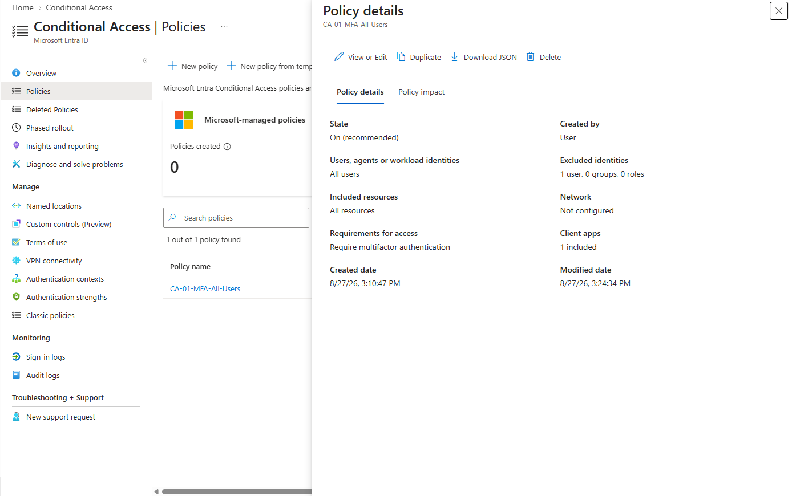
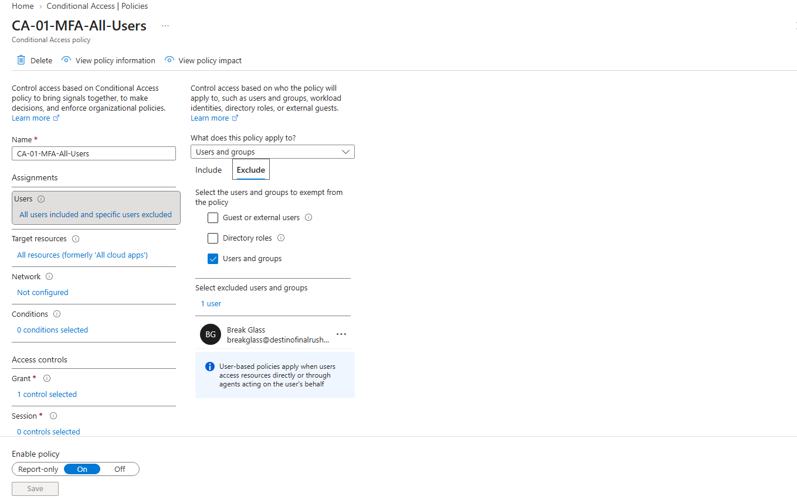
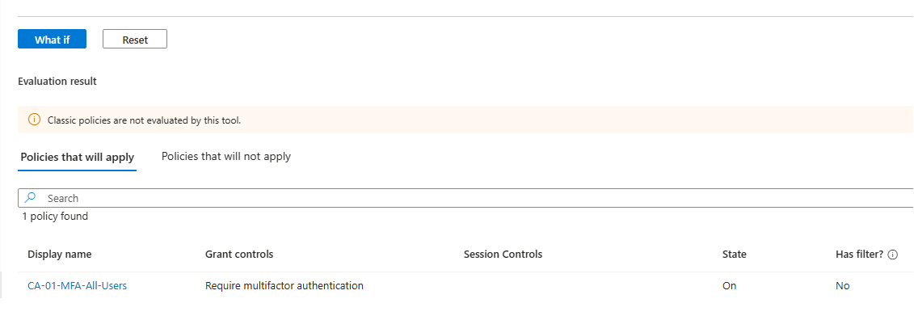
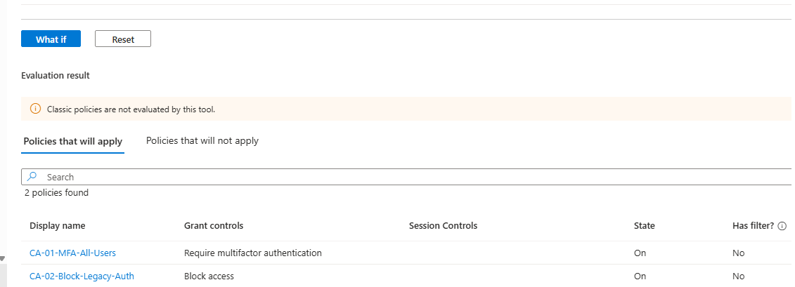
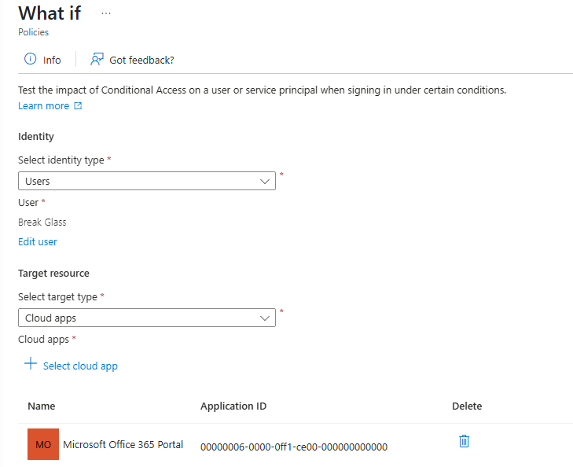
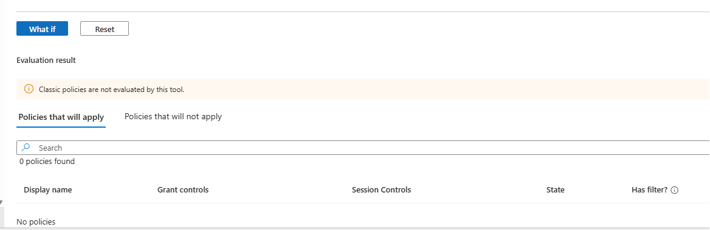

# 02 — Conditional Access

1 Sep 2026. Norte Club. Entra ID P2 trial.

This is a lab. I do not administer Entra at work.

## What I was trying to do

Get off Security defaults and onto policies I can explain.

I wanted four things:

1. Everyone gets MFA
2. One emergency account does not
3. Old protocols that skip MFA are blocked
4. Admin roles have MFA even if someone later weakens the all-users policy

Risk policies came later. They are CA-04 / CA-05 / CA-06. Ticket NC-007.

## What I built

**CA-01-MFA-All-Users**
I built this from a blank policy on purpose. I needed to click Users, Exclude, Grant, and On myself. The templates try to exclude whatever account I am signed in as. That would have excluded admin. admin is the account I work in. The exception is breakglass.

All users. Exclude Break Glass. All cloud apps. Require MFA. On.

I turned Security defaults off only after this policy existed. Microsoft will not let both run.

**CA-02-Block-Legacy-Auth**
I used Microsoft’s “Block legacy authentication” template, then I edited it. The important part of that template is the client list: Exchange ActiveSync and Other clients. If I tick Browser by mistake I lock myself out. If I tick nothing, the policy does nothing.

Same exclude: Break Glass. Grant: Block. On.

**CA-03-MFA-Admins**
Same pattern. Template for “MFA for admins,” then edit. It targets directory roles, not all users. Break Glass is a Global Admin, so I excluded that account or the emergency login would get MFA and the back door would be useless.

On. It overlaps CA-01. That is fine.

I did not use the device-compliance or MDM templates. I have no Intune devices in this tenant.

**CA-04 / CA-05 / CA-06**
Built 31 Aug 2026. Same exclude: Break Glass. `admin` stays in.

- CA-04-Block-High-Signin-Risk — Block High sign-in risk
- CA-05-MFA-Medium-Signin-Risk — MFA on Medium sign-in risk
- CA-06-PasswordChange-Medium-User-Risk — password change on Medium and High user risk

Legacy Identity Protection user-risk and sign-in-risk policies were already Disabled. I left them Disabled. I did not generate a fake risk event. NC-007.

## Proof

What If was the first pass. It is not the hire-bar proof.

| Who | Client | What If said | Shot |
|---|---|---|---|
| Standard User | Browser | CA-01 applies. Require MFA. |  |
| Standard User | Other clients | CA-01 wants MFA. CA-02 blocks. Block wins. |  |
| Break Glass | Browser | No policy applies. |   |

Live row. 28 Aug 2026 12:58:50 PM. `user.standard`. Azure Portal. Success.

| Policy | Result |
|---|---|
| CA-01-MFA-All-Users | Success |
| CA-02-Block-Legacy-Auth | Not Applied |
| CA-03-MFA-Admins | Not Applied |

Same-day Interrupted and Failure rows stay in the list shot. Ticket: [NC-001](evidence/tickets/NC-001-live-signin-user-standard.md).

## Why I excluded Break Glass and not admin

admin is the daily account. If I exclude it, MFA is theater.

breakglass is standing Global Admin that I do not use. If I include it in CA-01 and Authenticator dies, I have no way back in.

Legacy auth cannot do MFA, so I block it rather than challenge it.

## What this does not prove

- Named locations
- Intune / device compliance
- A real High sign-in-risk event
- Production Entra work
