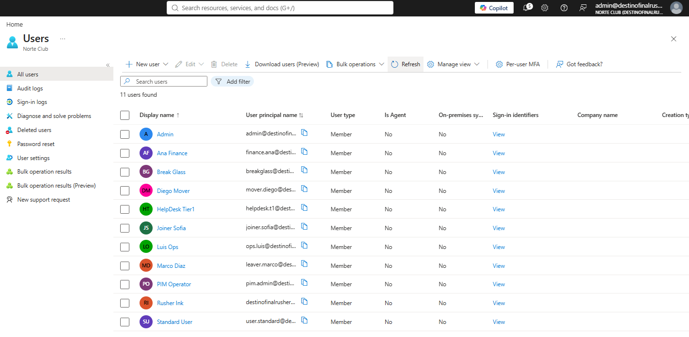
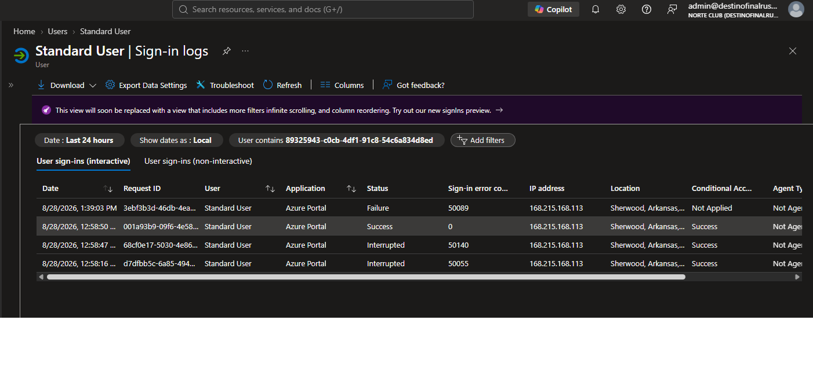
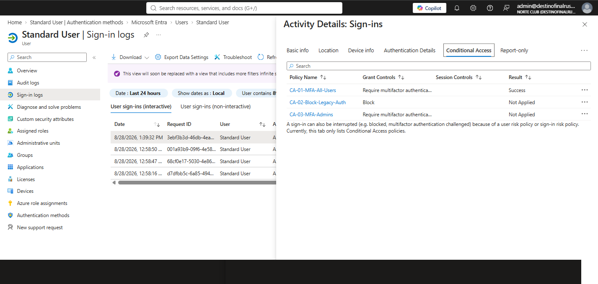

# Norte Club — Entra identity lab

Norte Club is a fictional gym and payments company. I built its Entra tenant from scratch so I could do identity work end to end instead of reading about it. Angel Rodriguez Bolivar.

## What I do in production

At ABC Fitness I verify the requester's identity first along with their club unique ID#, I ask for pin secret as a 2FA method to authenticate client. then I check the level of authorization 1-low, 2-medium, 3-high, . Password resets for example... can only be authorized by a level 3 client, so only If I authenticate won't be enough if the authorization level thresshold is not met. Also in Security Roles configurations we authenticate + check authorization level, if less than 2 = do not permit, if is lvl 3 we can help configure the employees, trainers, sellers, admins roles + permissions and allowlists.

At Remitly I triaged ATO and fraud alerts in a live queue under SLA: release, hold, or block (suspend), on incomplete information.

CompTIA Security+. Detection work lives in [angelrbolivar-soc-portfolio](https://github.com/angelrbolivar/angelrbolivar-soc-portfolio).

## Rules

- `admin` is the daily Global Admin. It stays inside Conditional Access. I do not exclude the account I work in.
- `breakglass` is the only standing emergency Global Admin and the only CA exclusion. I do not use it.
- `helpdesk.t1` holds no standing directory role. Tier-1 is not a privilege path.
- Privileged changes get a ticket: requester, verification, before, after, rollback.

## What exists now

2 Sep 2026. Hire bar complete. Graph dump 1 Sep 2026 is in git.

- Directory and groups: [01-identities.md](01-identities.md)
- CA-01 / CA-02 / CA-03 On, Security defaults off: [02-conditional-access.md](02-conditional-access.md)
- Live sign-in for `user.standard`, CA-01 Success on the log row, not What If: [NC-001](evidence/tickets/NC-001-live-signin-user-standard.md)
- SSPR scoped to `GRP-SSPR-Enabled` only, not All: [NC-002](evidence/tickets/NC-002-sspr-group.md)
- MFA wipe + session revoke + recover on `user.standard`: [NC-003](evidence/tickets/NC-003-mfa-wipe-user-standard.md)
- Joiner TAP + Authenticator for `joiner.sofia`: [NC-004](evidence/tickets/NC-004-tap-joiner-sofia.md)
- PIM: `pim.admin` eligible Authentication Administrator, approved activation, then deactivated: [NC-005](evidence/tickets/NC-005-pim-auth-admin-eligible.md)
- T1 path: `GRP-RA-Helpdesk` holds Auth Admin. `helpdesk.t1` Eligible Member only: [NC-006](evidence/tickets/NC-006-pim-group-helpdesk.md)
- Risk: CA-04 block High sign-in risk, CA-05 MFA Medium sign-in risk, CA-06 password change Medium+ user risk. Legacy IDP policies left Disabled: [NC-007](evidence/tickets/NC-007-risk-policies.md)
- App: `nc-timeclock` assignment required on `GRP-Ops`. User consent disabled: [NC-008](evidence/tickets/NC-008-app-consent-lock.md)
- Entitlement: catalog Norte Club, ToU, package `AP-Ops-Access` → `GRP-Ops` Member: [NC-009](evidence/tickets/NC-009-access-package-ops.md)
- Access review `AR-Finance-Q` on `GRP-Finance`, reviewer `admin`, auto-apply off: [NC-010](evidence/tickets/NC-010-review-finance.md)
- Directory fill: `ops.luis`, `finance.ana`, `mover.diego` in groups: [NC-011](evidence/tickets/NC-011-directory-fill.md)
- Leaver: `leaver.marco` disabled, sessions revoked, `GRP-Ops` removed: [NC-012](evidence/tickets/NC-012-leaver-marco.md)
- Mover: `mover.diego` left `GRP-Ops`, entered `GRP-Finance`: [NC-013](evidence/tickets/NC-013-mover-diego.md)
- MFA wipe on `joiner.sofia` while `pim.admin` Auth Admin was active: [NC-015](evidence/tickets/NC-015-mfa-wipe-via-pim.md)
- Guest: `Vendor Guest` invited, no groups, no roles: [NC-014](evidence/tickets/NC-014-guest-vendor.md)
- Identity Secure Score baseline: 53.33% on 28 Aug 2026

## Users and groups

`admin` — daily Global Admin, in CA.
`breakglass` — standing Global Admin, unused, excluded from CA.
`helpdesk.t1`, `pim.admin`, `user.standard`, `joiner.sofia`, `ops.luis`, `finance.ana`, `mover.diego` — no standing directory role. `pim.admin` is eligible Authentication Administrator via PIM only.
`leaver.marco` — disabled 31 Aug 2026. No standing role. Groups empty.
`Vendor Guest` — B2B. No group. No role.

Groups: `GRP-Ops` member `Luis Ops`. `GRP-Finance` members `Ana Finance`, `Diego Mover`. `GRP-IT` empty. Not role-assignable.
`GRP-SSPR-Enabled` — security, assigned, not role-assignable. Member: `user.standard` only.
`GRP-RA-Helpdesk` — role-assignable. Auth Admin Active on the group. Zero standing members. `helpdesk.t1` Eligible Member.

Leftover personal account from trial signup is cropped and unused.

## Conditional Access

Six policies, all On. `breakglass` excluded from each. `admin` is not.

- **CA-01-MFA-All-Users** — Require MFA
- **CA-02-Block-Legacy-Auth** — Block Exchange ActiveSync and Other clients
- **CA-03-MFA-Admins** — Require MFA for privileged roles
- **CA-04-Block-High-Signin-Risk** — Block High sign-in risk
- **CA-05-MFA-Medium-Signin-Risk** — MFA on Medium sign-in risk
- **CA-06-PasswordChange-Medium-User-Risk** — Password change on Medium and High user risk

What If was the first pass. The hire-bar proof is a live row:

28 Aug 2026 12:58:50 PM. `user.standard`. Azure Portal. Success.

| Policy | Result |
|---|---|
| CA-01-MFA-All-Users | Success |
| CA-02-Block-Legacy-Auth | Not Applied |
| CA-03-MFA-Admins | Not Applied |

Same-day Interrupted and Failure rows stay in the list shot. I did not crop them.

## Tickets

| ID | Action |
|---|---|
| [NC-001](evidence/tickets/NC-001-live-signin-user-standard.md) | Live sign-in `user.standard` to prove CA-01 |
| [NC-002](evidence/tickets/NC-002-sspr-group.md) | SSPR on `GRP-SSPR-Enabled` only |
| [NC-003](evidence/tickets/NC-003-mfa-wipe-user-standard.md) | MFA wipe, revoke sessions, recover `user.standard` |
| [NC-004](evidence/tickets/NC-004-tap-joiner-sofia.md) | TAP joiner `joiner.sofia`, then Authenticator |
| [NC-005](evidence/tickets/NC-005-pim-auth-admin-eligible.md) | PIM eligible Auth Admin, activate, approve, deactivate |
| [NC-006](evidence/tickets/NC-006-pim-group-helpdesk.md) | PIM for Groups T1 path |
| [NC-007](evidence/tickets/NC-007-risk-policies.md) | Risk CA-04 / CA-05 / CA-06. Legacy IDP left Disabled |
| [NC-008](evidence/tickets/NC-008-app-consent-lock.md) | nc-timeclock assignment required + consent lock |
| [NC-009](evidence/tickets/NC-009-access-package-ops.md) | Catalog + ToU + `AP-Ops-Access` |
| [NC-010](evidence/tickets/NC-010-review-finance.md) | Access review `AR-Finance-Q` on `GRP-Finance` |
| [NC-011](evidence/tickets/NC-011-directory-fill.md) | Create `ops.luis`, `finance.ana`, `mover.diego`. Fill groups |
| [NC-012](evidence/tickets/NC-012-leaver-marco.md) | Disable `leaver.marco`, revoke sessions |
| [NC-013](evidence/tickets/NC-013-mover-diego.md) | Move `mover.diego` Ops → Finance |
| [NC-014](evidence/tickets/NC-014-guest-vendor.md) | Invite `Vendor Guest`. No groups. No roles |
| [NC-015](evidence/tickets/NC-015-mfa-wipe-via-pim.md) | Wipe `joiner.sofia` MFA while PIM Auth Admin active |

## Evidence

All portal shots live in `evidence/tickets/` markdown and `evidence/screenshots/`. There is no second `screenshots/` folder at repo root.

Tickets use `../screenshots/file.png` because they sit in `evidence/tickets/`. README and modules use `evidence/screenshots/file.png`.

Graph is HOME only. Scripts in `scripts/graph/`. Dump night 1 Sep 2026, files in [evidence/graph-exports/](evidence/graph-exports/):

- `20260901-users.json` `20260901-groups.json` `20260901-directory-roles.json` `20260901-ca-policies.json`
- `20260901-pim-entra.json` `20260901-pim-groups.json` 
- `20260901-access-packages.json` `20260901-access-reviews.json`
- `20260901-leaver-marco-before.json` `20260901-leaver-marco-after.json`
- `20260901-signins.json` `20260901-audit.json`

Leaver revoke used `POST .../revokeSignInSessions`. `Revoke-MgUserSignInSession` was not on the machine. Sign-in/audit used Graph REST, not `Microsoft.Graph.Reports`.
