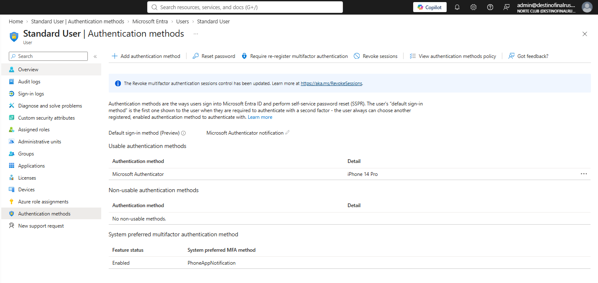
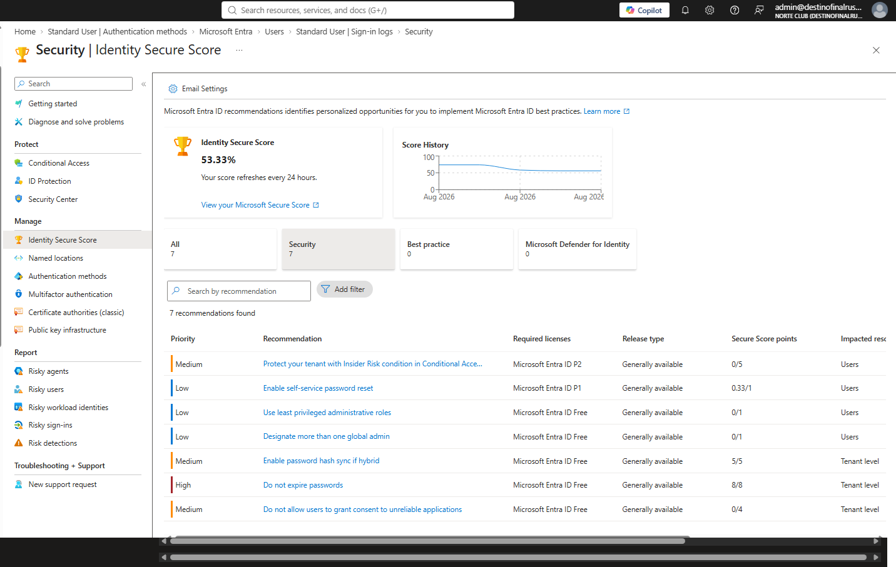

# NC-001 live sign-in user.standard

Date: 28 Aug 2026
Requester: Angel (lab operator)
Requested action: first interactive sign-in for user.standard to prove CA-01 with a log row, not What If
Verification: I control the lab account user.standard@destinofinalrusheroutlook.onmicrosoft.com
Password reset this block: yes

## Before

Proof for CA-01 was What If only. No live Success row used as hire-bar evidence. Methods at the start of the block were not captured empty. First live sign-in had already completed before shot 10.

## After

- Usable method: Microsoft Authenticator, iPhone 14 Pro
- Default sign-in method: Microsoft Authenticator notification
- System preferred MFA: PhoneAppNotification, Enabled
- 28 Aug 2026 12:58:50 PM
- User: Standard User / user.standard@destinofinalrusheroutlook.onmicrosoft.com
- Application: Azure Portal
- Status: Success
- IP: 168.215.168.113 (Sherwood, Arkansas)
- Conditional Access column: Success
- CA-01-MFA-All-Users: Success, grant Require MFA
- CA-02-Block-Legacy-Auth: Not Applied
- CA-03-MFA-Admins: Not Applied
- Identity Secure Score baseline: 53.33% on 28 Aug 2026

Same-day rows left in shot 12 on purpose:

- 1:39:03 PM Failure 50089 CA Not Applied
- 12:58:47 Interrupted 50140 CA Success
- 12:58:16 Interrupted 50055 CA Success

## Shots

Authenticator on the account after the sign-in:

Sign-in list. Proof row is 12:58:50 PM Success:

Conditional Access tab on that row:

Score baseline. Not chased:

## Rollback

None. Account stays enabled. Method stays. Wipe is NC-003.

Blades: Users > Standard User > Sign-in logs > Conditional Access tab. Identity Secure Score. Authentication methods.
