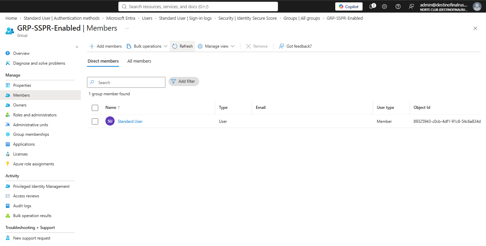
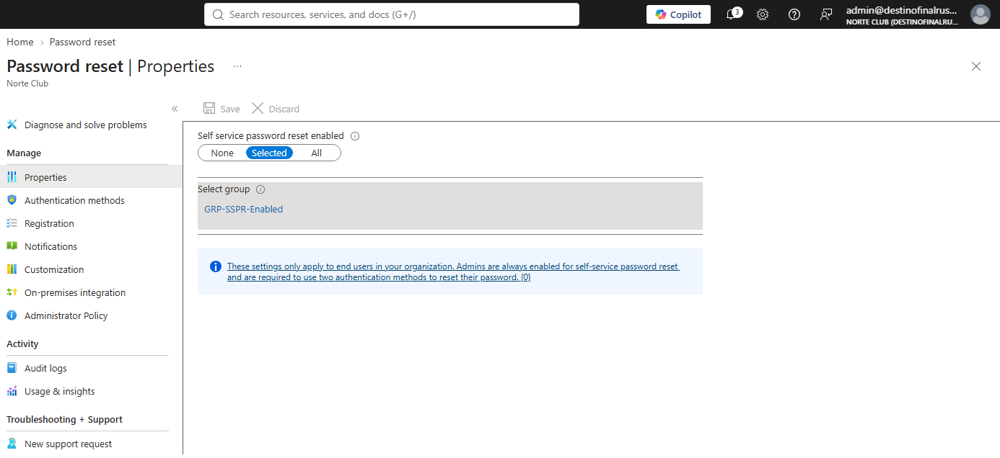

# NC-002 SSPR on a group

Date: 28 Aug 2026
Requester: Angel
Requested action: enable self-service password reset for GRP-SSPR-Enabled only
Verification: I own the lab directory

## Before

Password reset > Properties: Self service password reset enabled = None.

## After

- Properties: Selected
- Group: GRP-SSPR-Enabled only
- Member: user.standard only
- Authentication methods tab: 1 method required. Security questions off. Other methods deferred to auth methods policy.
- Registration: Require users to register when signing in = Yes. Re-confirm = 180 days.
- On-premises integration: not enabled.

Admin SSPR stays on Microsoft default (admins enabled, two methods). Properties stays Selected, not All.

## Shots

Group and member:

Properties after save:

## Rollback

Properties → None, or remove user.standard from GRP-SSPR-Enabled.

Blades: Groups > GRP-SSPR-Enabled. Protection > Password reset > Properties, Authentication methods, Registration.

Password reset walk is NC-003.
