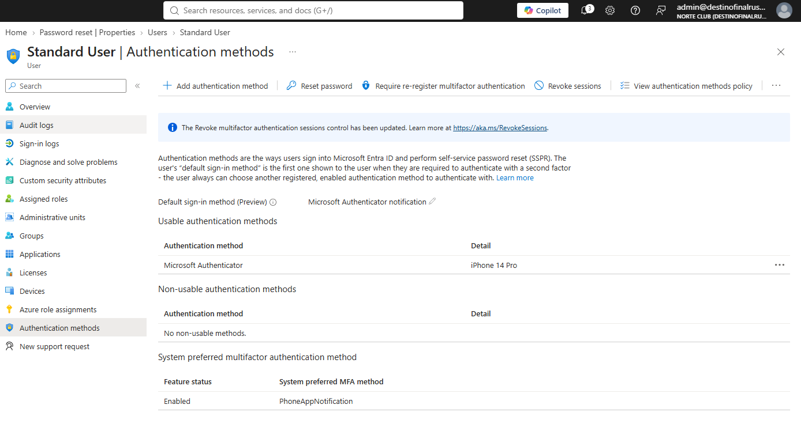
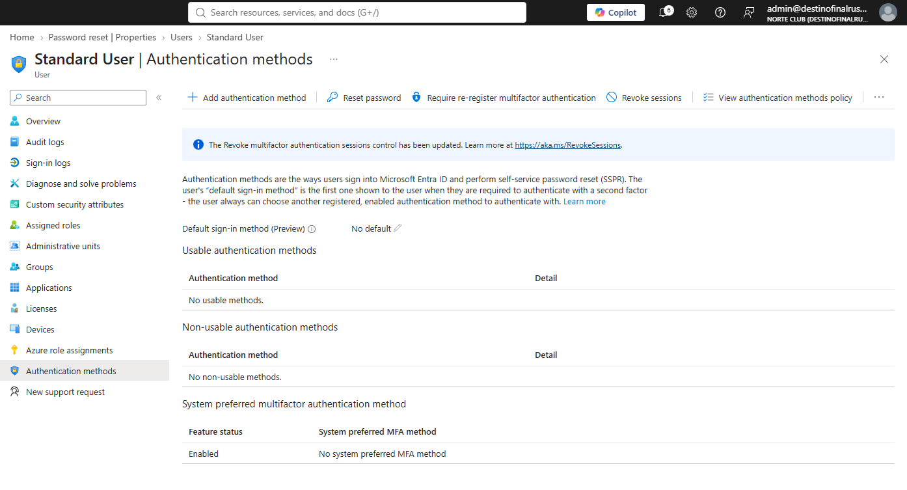
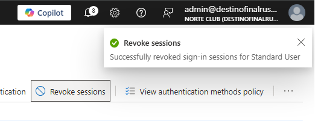
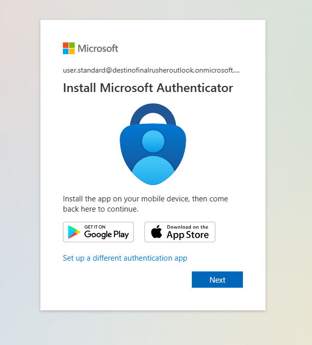
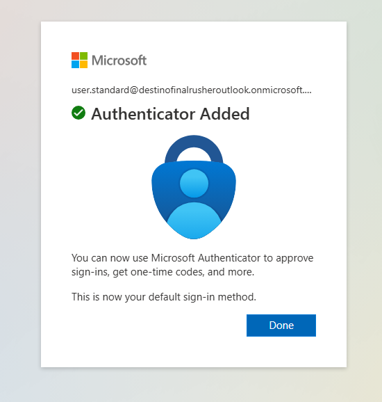

# NC-003 MFA wipe user.standard

Date: 28 Aug 2026
Requester: Angel acting for user.standard
Requested action: wipe MFA methods, require re-register, revoke sessions, then recover
Verification: I control user.standard@destinofinalrusheroutlook.onmicrosoft.com

## Before

- Usable method: Microsoft Authenticator, iPhone 14 Pro
- Default: Microsoft Authenticator notification

## After wipe

- Usable methods: none
- Default: none
- Sessions revoked for Standard User

## Interrupt

InPrivate sign-in to My Security Info as user.standard. No method left. Entra forced Authenticator setup. Shot is the Install Microsoft Authenticator page. No QR in git.

## Recovered

Authenticator added again. Default sign-in method restored. Account not left stranded.

## Rollback

Same ticket: re-register Authenticator. Done.

Blades: Users > Standard User > Authentication methods. Require re-register multifactor authentication. Revoke sessions. InPrivate My Security Info.

helpdesk.t1 did not perform this wipe. No standing role on T1. PIM wipe is a later ticket.
