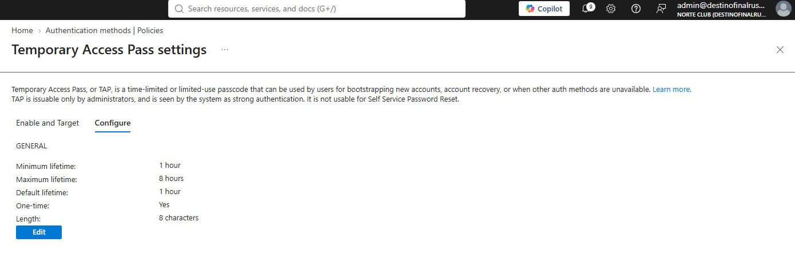
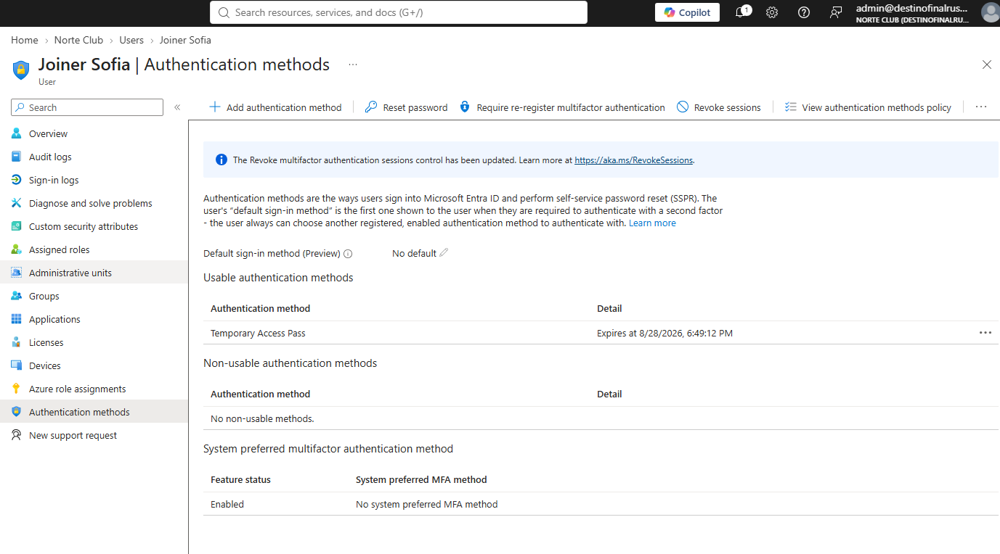
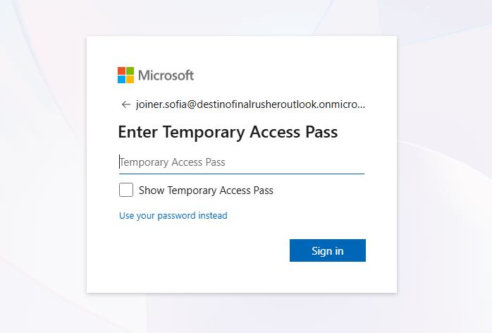
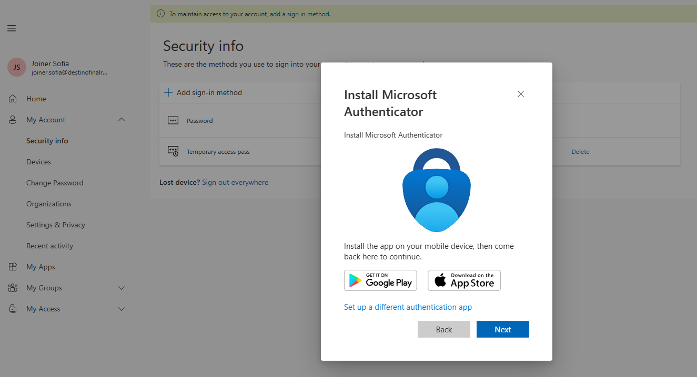
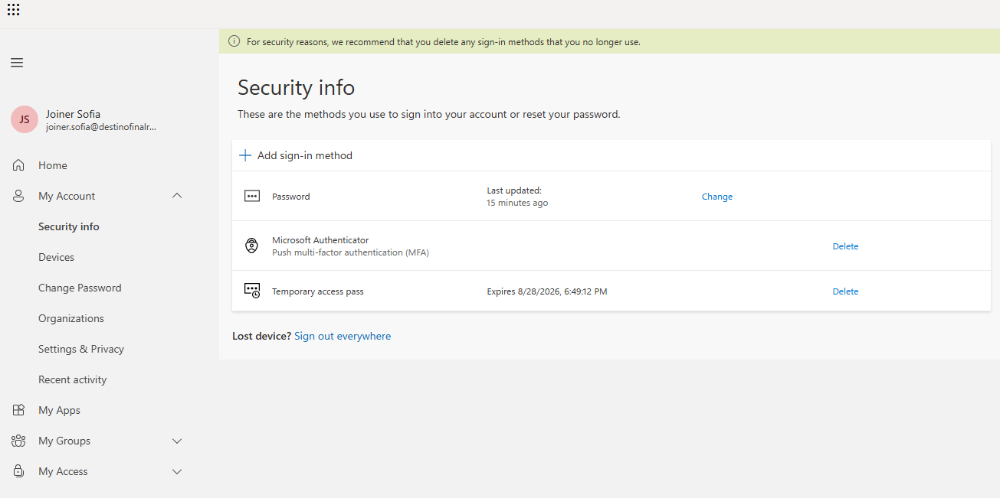

# NC-004 TAP joiner.sofia

Date: 28 Aug 2026
Requester: Angel (lab operator)
Requested action: create joiner.sofia, issue a one-time TAP, redeem it, register Authenticator
Verification: I created the account and issued the TAP

## Before

- joiner.sofia did not exist
- TAP tenant policy existed (Enabled / All users). One-time default was No. I set One-time to Yes, default lifetime 1 hour.

## After

- User: joiner.sofia@destinofinalrusheroutlook.onmicrosoft.com, enabled, Member, no directory role
- TAP issued, one-time, 1 hour, expires 28 Aug 2026 6:49:12 PM
- Redeemed at My Security Info with the TAP prompt (not password)
- Microsoft Authenticator registered (push MFA)

TAP string and QR are not in git.

## Rollback

Delete joiner.sofia, or delete the TAP and disable the account. Policy One-time can go back to No. I leave One-time Yes.

Blades: Authentication methods > Temporary Access Pass. Users > Create. Joiner Sofia > Authentication methods. My Security Info as joiner.sofia.
