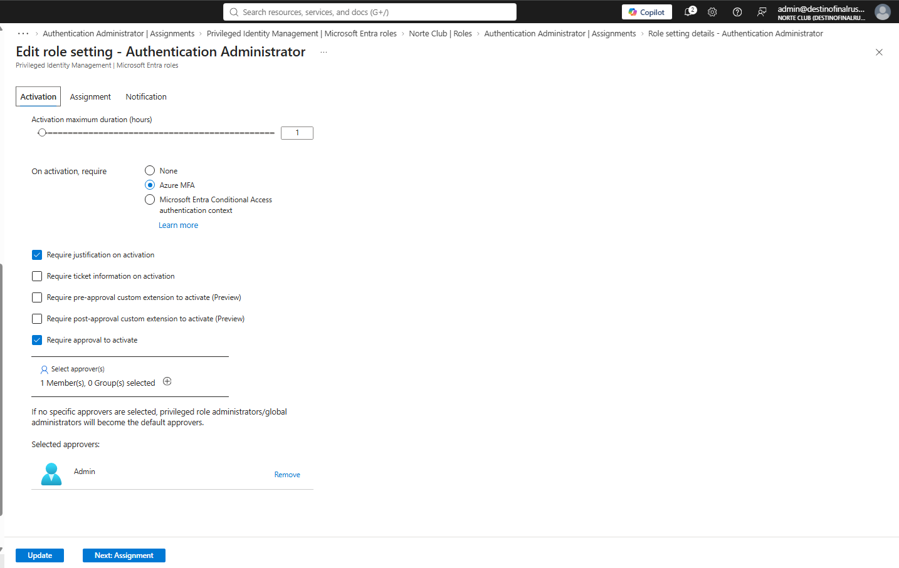
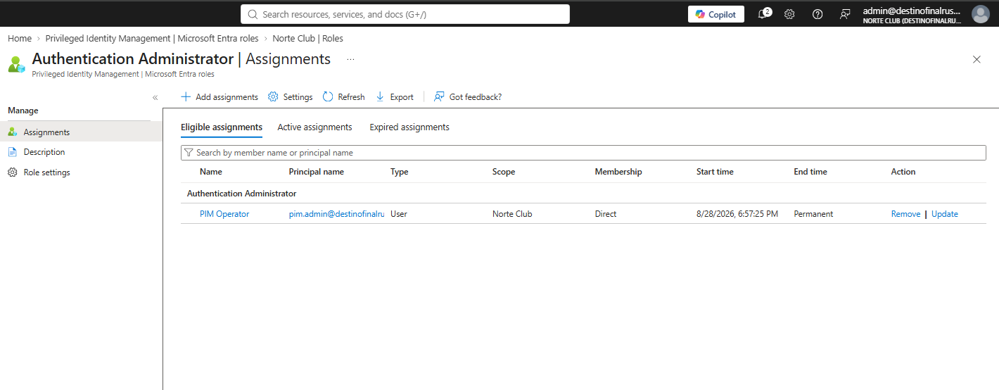
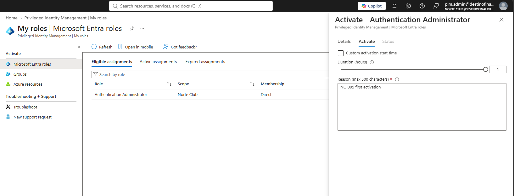
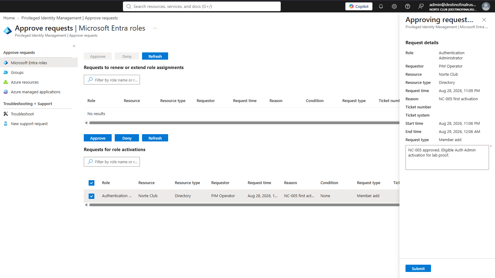
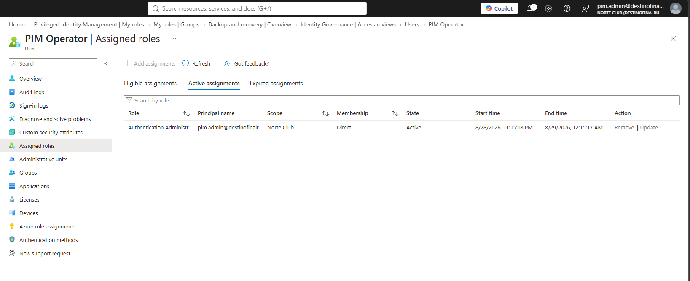
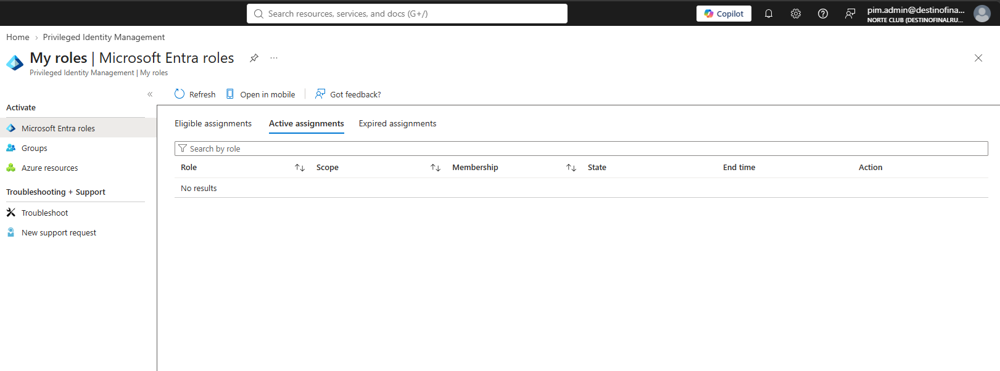

# NC-005 PIM eligible Auth Admin

Date: 28 Aug 2026
Requester: PIM Operator / pim.admin
Approver: admin
Requested action: eligible Authentication Administrator, activate 1 hour, approve, deactivate
Verification: I control pim.admin and admin

## Before

- pim.admin had no standing directory role and no PIM eligible assignment
- Authentication Administrator role settings were defaults

## After — settings

- Activation max: 1 hour
- On activation: Azure MFA
- Justification required
- Approval required
- Approver: admin@destinofinalrusheroutlook.onmicrosoft.com only
- Permanent eligible allowed
- Permanent active not allowed

## After — assignment

pim.admin eligible Authentication Administrator, permanent, Direct, Norte Club. Active list empty before the first activation.

## Activation

pim.admin My roles → Activate. Reason: NC-005 first activation. Duration 1 hour. Request scheduled pending approval.

## Approval

admin Approve requests. Role Authentication Administrator. Requestor PIM Operator. Reason NC-005 first activation. Window 28 Aug 11:06 PM → 29 Aug 12:06 AM.

## Active then revoked

Active 28 Aug 2026 11:15 PM → 29 Aug 2026 12:15 AM. Then deactivated by pim.admin. Active assignments: no results. Eligible assignment left in place.

## Rollback

Deactivate ends the clock. Eligible assignment can be Removed from Authentication Administrator > Eligible assignments if we need to unwind the grant. Standing Active was never used.

Blades: PIM > Microsoft Entra roles > Authentication Administrator > Settings, Assignments. My roles. Approve requests.

No Global Admin eligible on pim.admin. helpdesk.t1 not in this ticket.
