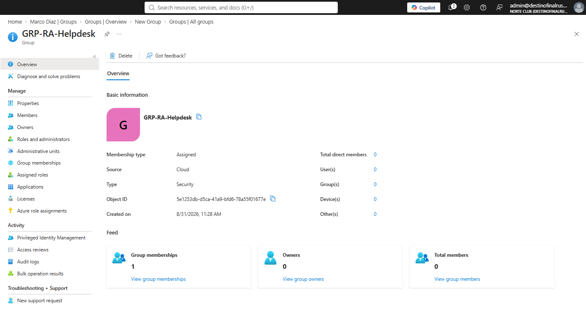
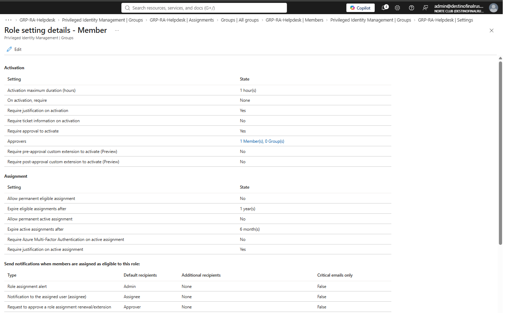
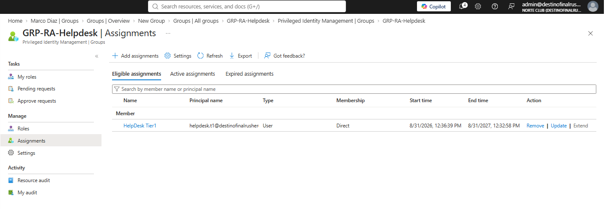
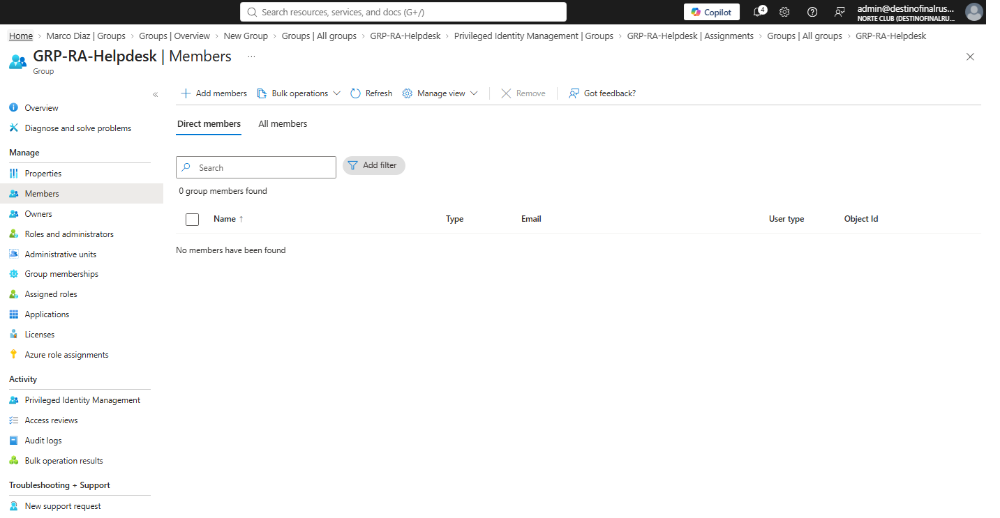
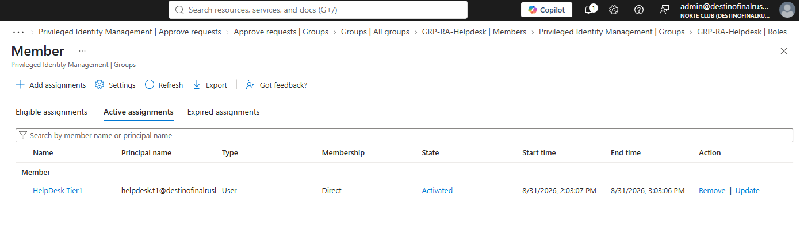
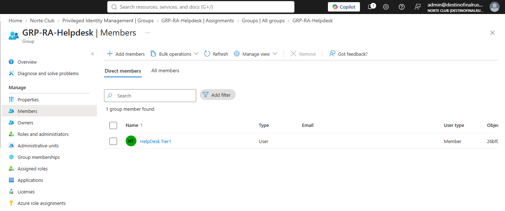
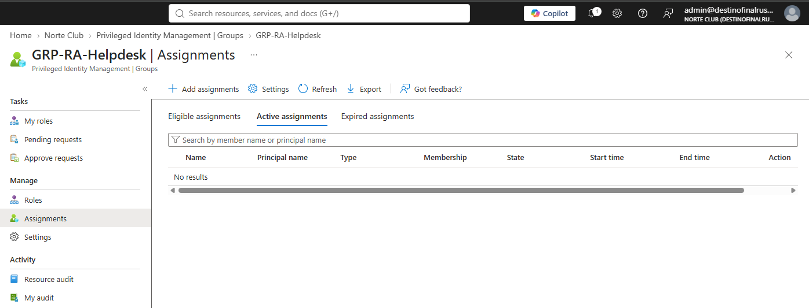
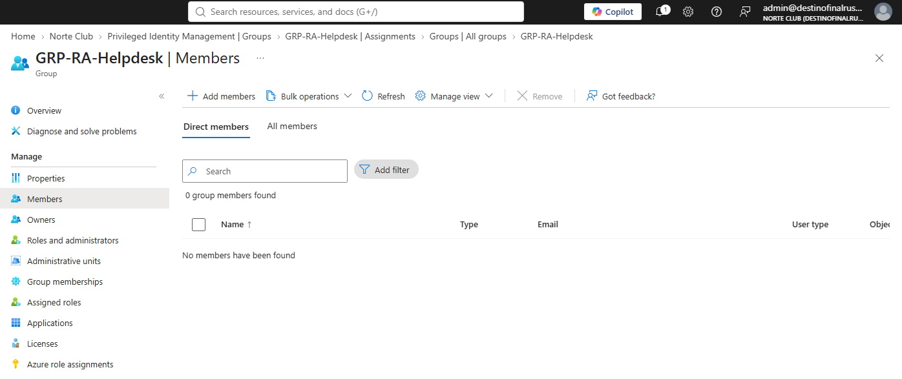

# NC-006 PIM group helpdesk

Date: 31 Aug 2026
Requester: Norte Club ops / T1 path
Approver: admin
Requested action: role-assignable group holds Authentication Administrator. helpdesk.t1 eligible Member via PIM for Groups. Activate 1 hour. Approve. Deactivate.
Verification: I control helpdesk.t1@destinofinalrusheroutlook.onmicrosoft.com. User has no standing directory role.

## Decision

Privilege sits on `GRP-RA-Helpdesk`, not on the T1 user. Membership is the clock. Directory role on the group is Active. Do not also make that role Eligible on the group. One hop.

## Before

- No role-assignable group
- helpdesk.t1 Assigned roles: none
- helpdesk.t1 not a standing member of any privileged group

## After — group

- Name: GRP-RA-Helpdesk
- Type: Security
- Role-assignable: Yes
- Assigned roles: Authentication Administrator, Active, permanent
- Standing Members: 0

## After — PIM for Groups Member settings

- Activation max: 1 hour
- On activation require: None (CA-01 already MFA)
- Justification required: Yes
- Approval required: Yes
- Approver: admin only
- Permanent eligible: No
- Permanent active: No

## After — eligible member

helpdesk.t1 Eligible Member, Direct, 31 Aug 2026 → 31 Aug 2027. Active list empty before first activation. Group Members blade: 0.

## Activation

helpdesk.t1 My roles → Groups → Member → Activate. Reason: NC-006 activate helpdesk membership. Duration 1 hour. Pending admin.

## Approval

admin Approve requests → Groups. Window 31 Aug 2026 2:03 PM → 3:03 PM.

## Deactivated

helpdesk.t1 Deactivate. Active assignments: empty. Group Members: 0. Eligible assignment left in place.

## Not done this ticket

Did not open Authentication methods on a test account while membership was live. Optional rerun later. Not required for the hire-bar walk.

## Rollback

Deactivate ends the clock. Remove Eligible assignment on GRP-RA-Helpdesk if the grant must die. Do not delete the group until the P2 Graph dump exists. Do not assign Authentication Administrator to helpdesk.t1 as a user.

Blades: Groups > GRP-RA-Helpdesk > Members, Assigned roles, Privileged Identity Management. PIM > Groups > Settings / Assignments / Approve requests. My roles > Groups.

No standing directory role on helpdesk.t1. admin stays in CA-01. breakglass untouched.
