# NC-007 risk policies

Date: 31 Aug 2026
Requester: Norte Club security / ATO path
Requested action: wire user risk and sign-in risk. High sign-in risk blocks. Medium sign-in risk requires MFA. Medium+ user risk requires password change.
Verification: I own the tenant. breakglass is the emergency account.

## Decision

Legacy ID Protection User risk / Sign-in risk policies are read-only and retire 1 Oct 2026. Both were Disabled (All users, Low and above, Block). I did not enable them. Live controls are Conditional Access.

admin stays in every policy. breakglass is the only exclude.

Do not combine user risk and sign-in risk on one policy.

## Before

- CA-01 / CA-02 / CA-03 On
- ID Protection user risk policy: read-only, Disabled
- ID Protection sign-in risk policy: read-only, Disabled
- Risk detections: empty

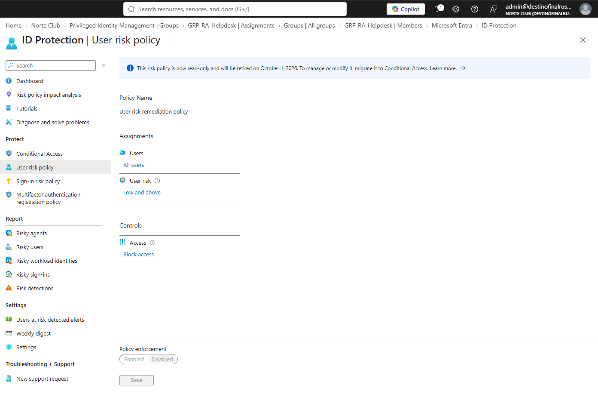

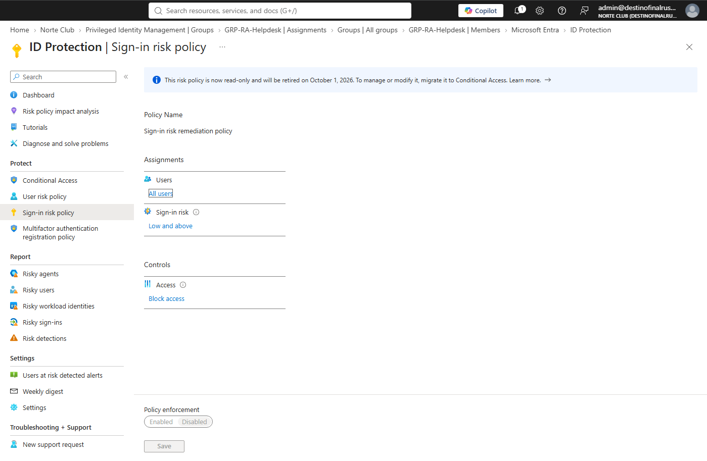

## After — Conditional Access

| Policy | Condition | Grant | Exclude |
|---|---|---|---|
| CA-04-Block-High-Signin-Risk | Sign-in risk High | Block | breakglass |
| CA-05-MFA-Medium-Signin-Risk | Sign-in risk Medium | Require MFA | breakglass |
| CA-06-PasswordChange-Medium-User-Risk | User risk Medium and High | Require password change + new sign-in each session | breakglass |

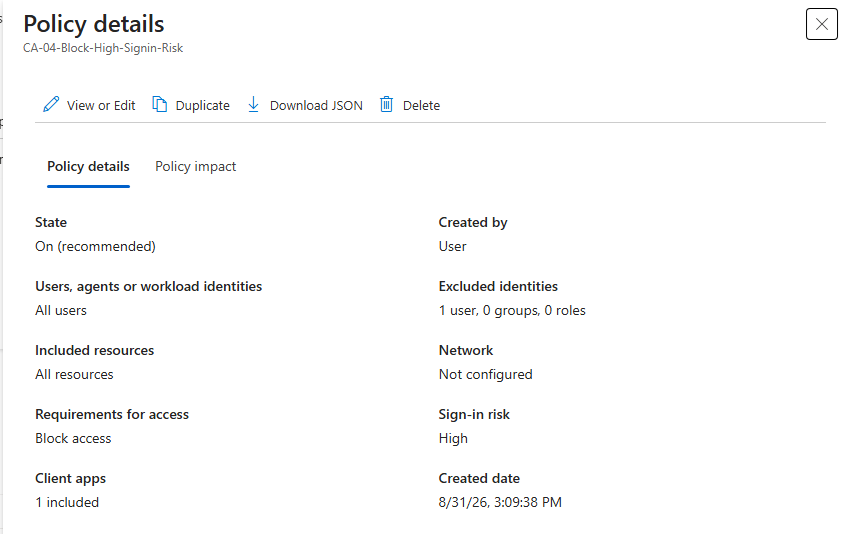

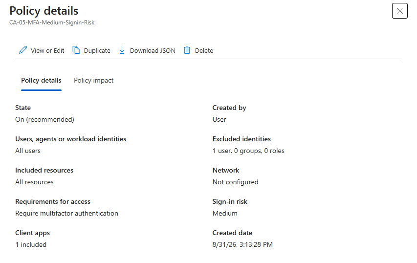

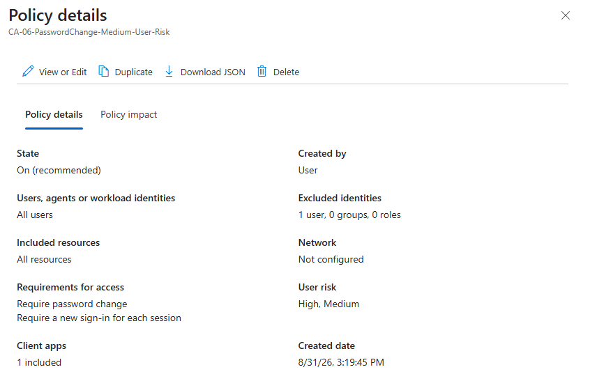

## What If

user.standard + High sign-in risk: CA-04 applies, Block.

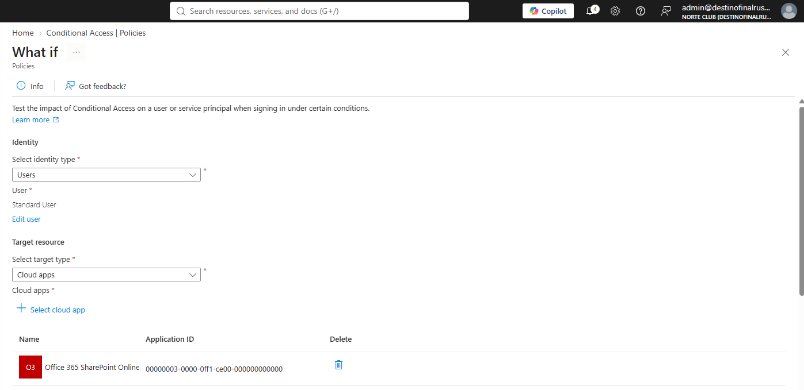

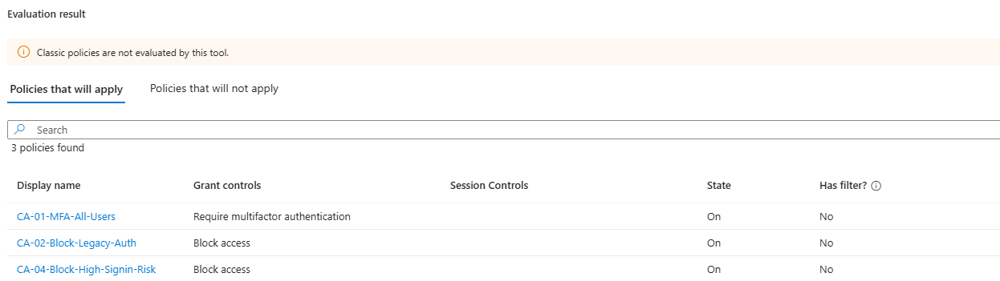

breakglass + High sign-in risk: 0 policies apply. CA-04 excluded.

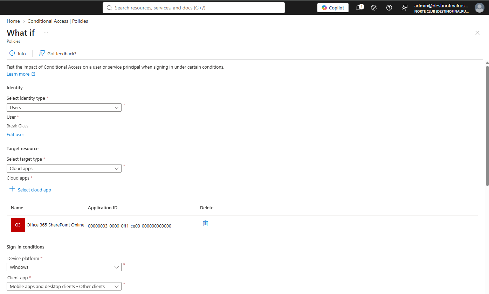

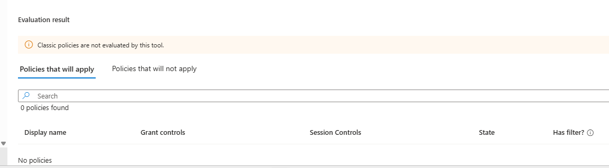

## Risk detections

No risk events found. Last month. High + Medium filter. I did not fake a risky sign-in.

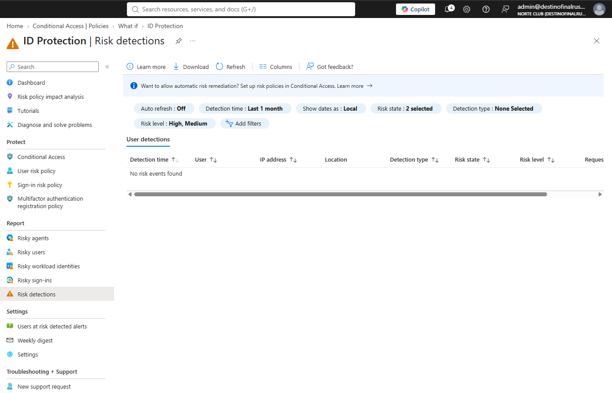

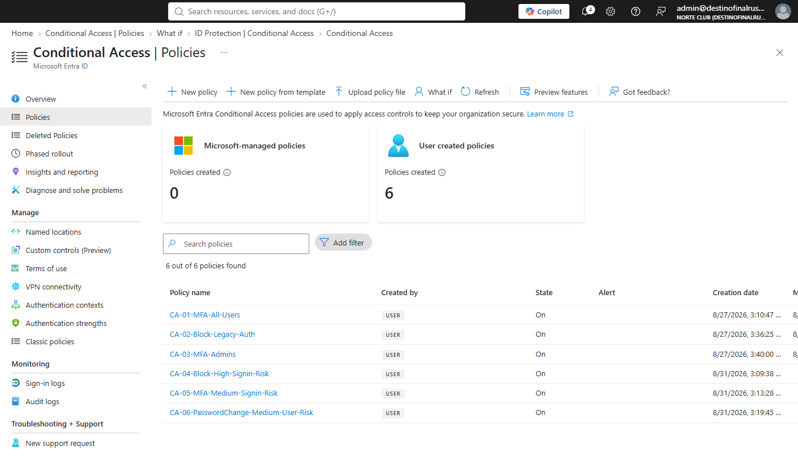

## Rollback

Set CA-04 / CA-05 / CA-06 to Off. Do not enable the legacy ID Protection policies.

Blades: Protection > Conditional Access > Policies. Protection > ID Protection > User risk policy, Sign-in risk policy, Risk detections. What If.
