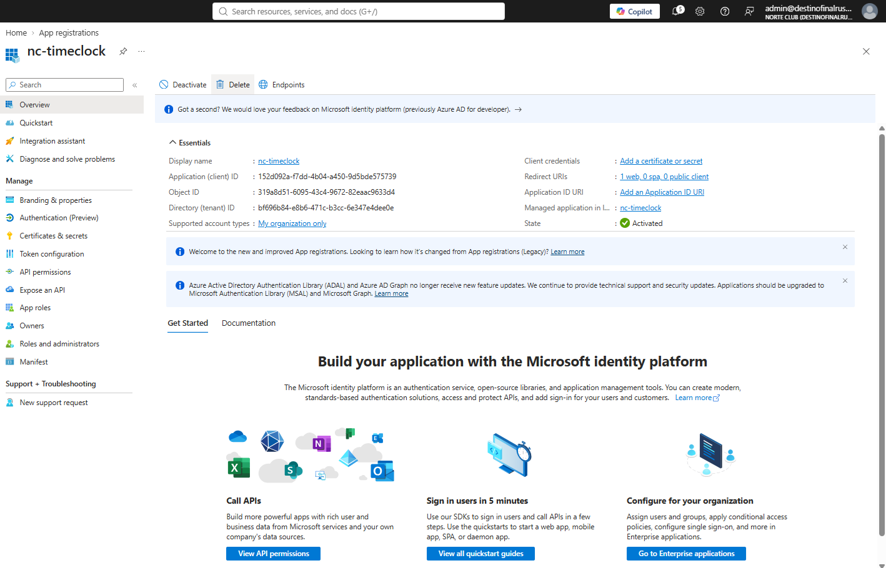
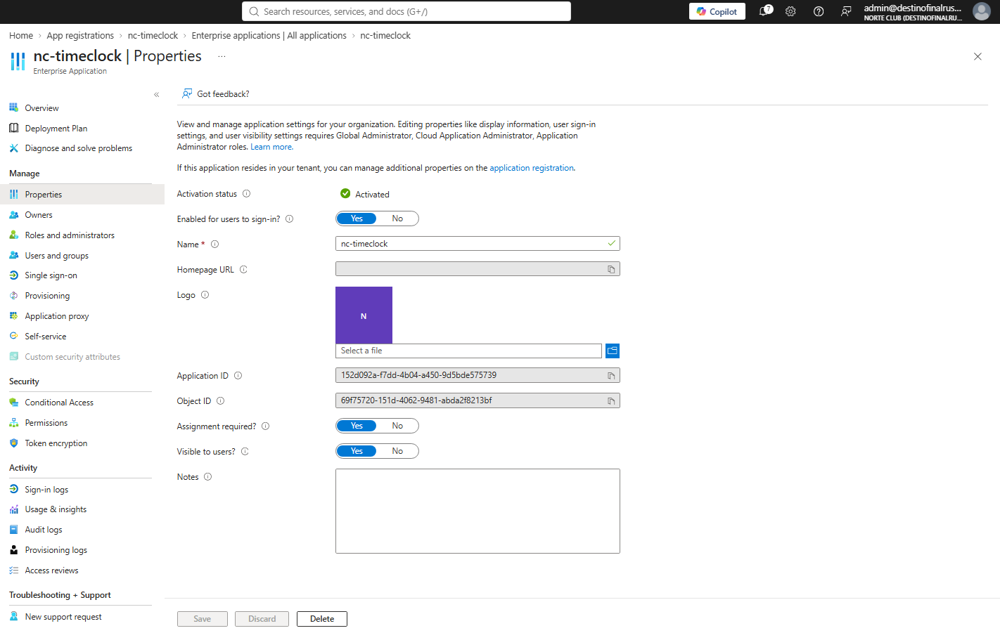
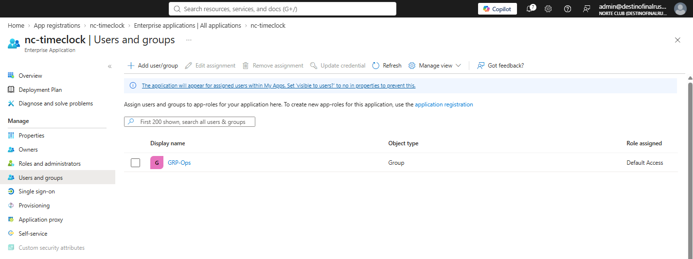
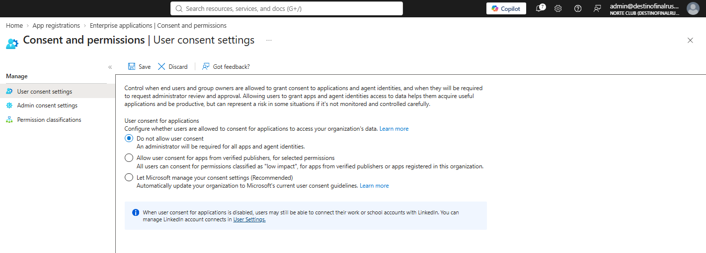
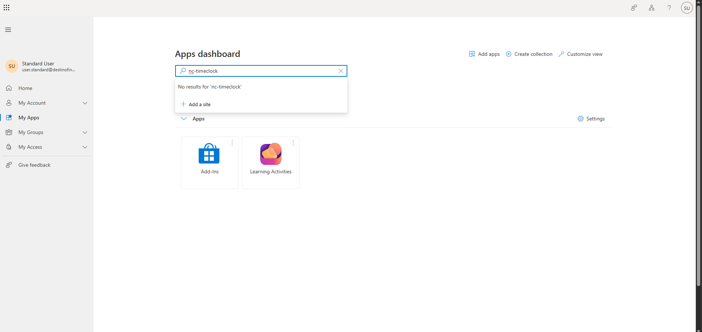

# NC-008 app consent lock

Date: 31 Aug 2026
Requester: Norte Club ops
Requested action: publish nc-timeclock, assignment required, lock user consent
Verification: user.standard is not in GRP-Ops.

## Decision

Shell app. No client secret. Redirect is https://localhost:3000 so the registration is valid without a public site. Gate is assignment, not a hosted app.

User consent = Do not allow user consent. Admin must consent for any app that needs org data.

## After

- App registration nc-timeclock. Single-tenant. 1 Web redirect. Certificates & secrets empty.
- Enterprise app Assignment required = Yes. Assigned: GRP-Ops only.
- User consent: Do not allow user consent.
- user.standard My Apps search for nc-timeclock: no results.

## Rollback

Assignment required = No restores the tile for everyone. User consent radio can be loosened. Do not delete the app until the directory export exists.

Blades: App registrations > nc-timeclock. Enterprise applications > nc-timeclock > Properties, Users and groups. Enterprise applications > Consent and permissions > User consent settings. My Apps as user.standard.
