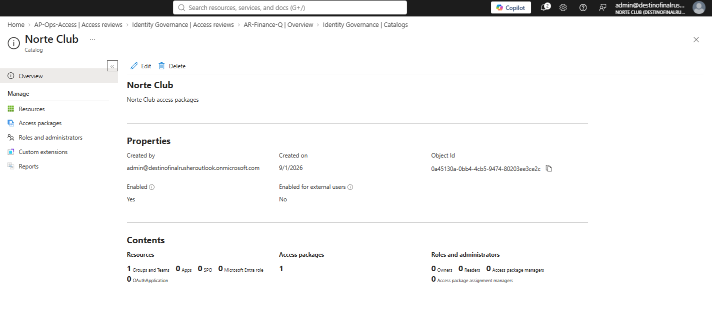
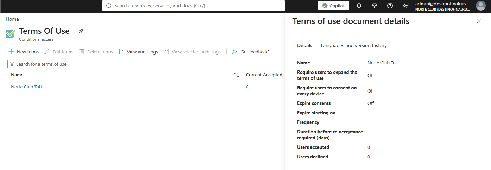
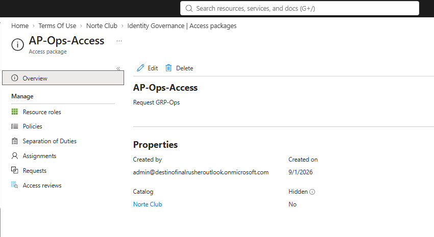

# NC-009 access package AP-Ops-Access

Date: 1 Sep 2026
Requester: Norte Club ops (lab)
Requested action: publish catalog Norte Club, ToU, access package that grants GRP-Ops Member on request
Verification: I own the tenant. admin is the only approver.

## Decision

One catalog. One package. Resource is GRP-Ops Member. Self can request. Approval required. Approver is admin, not Manager. Expire 30 days. No review attached to the package. No Verified ID. No Lifecycle Workflows.

## After

- Catalog Norte Club. Enabled. Not hidden.
- ToU Norte Club ToU exists.
- Package AP-Ops-Access. Resource GRP-Ops / Member. Who can request: Admin, Self. Require approval: Yes. 1 stage. First approver: Admin. Assignments expire after 30 days. 0 assignments. 0 pending requests.

## Rollback

Delete AP-Ops-Access first. Then the catalog if nothing else uses it. Do not delete GRP-Ops.

HOME same night: Export-PimGov.ps1 → YYYYMMDD-access-packages.json. If Graph waits, these shots are the dump.

Blades: Identity Governance > Entitlement management > Catalogs > Norte Club. Access packages > AP-Ops-Access.
