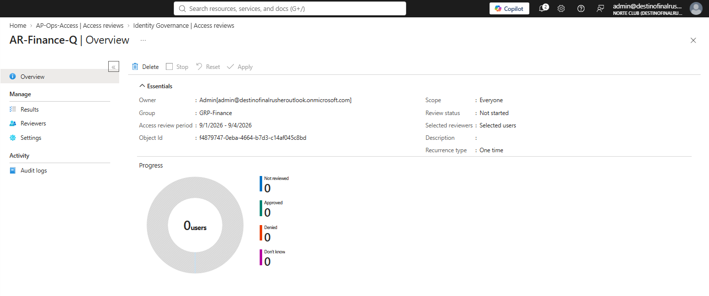

# NC-010 access review AR-Finance-Q

Date: 1 Sep 2026
Requester: Norte Club finance (lab)
Requested action: start one access review on GRP-Finance
Verification: I own the tenant. Reviewer is admin only.

## Decision

Resource review on GRP-Finance. Scope All users, not guests. Reviewer selected user admin. One time. 3 days. Auto apply off. If no response: No change. Empty membership is allowed. Do not invent finance users to make the donut move.

Review lives on the Access reviews blade, not the Access reviews tab inside AP-Ops-Access.

## After

- AR-Finance-Q created 1 Sep 2026
- Group GRP-Finance
- Scope Everyone
- Recurrence One time
- Period 9/1/2026 - 9/4/2026
- Selected reviewers: Selected users (admin)
- Users in review: 0
- Status Not started until the window opens
- Auto apply not used

## Rollback

Stop or Delete AR-Finance-Q. Do not Apply. Do not change GRP-Finance members from this ticket.

HOME same night: Export-PimGov.ps1 → YYYYMMDD-access-reviews.json. If Graph waits, this shot is the dump.

Blades: Identity Governance > Access reviews > AR-Finance-Q. Not Access packages > AP-Ops-Access > Access reviews.
