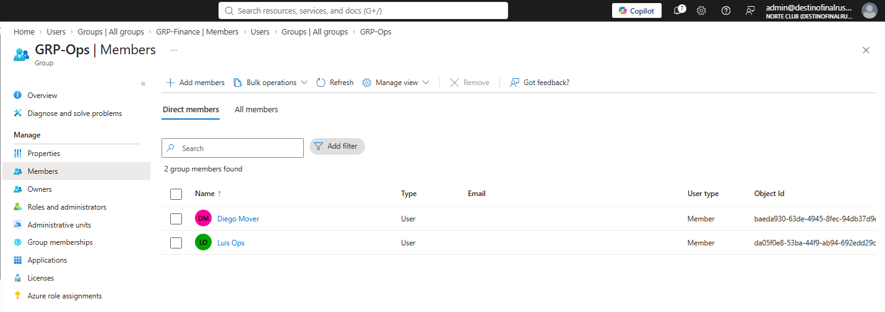
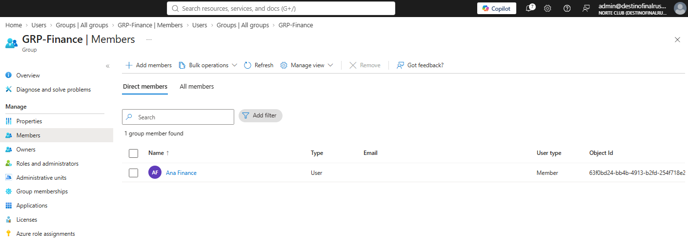

# NC-011 directory fill

Date: 1 Sep 2026
Requester: Norte Club ops (lab)
Requested action: create ops.luis, finance.ana, mover.diego. Put bodies in GRP-Ops and GRP-Finance
Verification: I own the tenant. No directory roles on these three.

## Decision

Three identities in the portal. No bulk create. No Graph. mover.diego starts in Ops so the next ticket has a from/to.

## After

- Luis Ops / ops.luis — Member. GRP-Ops.
- Ana Finance / finance.ana — Member. GRP-Finance.
- Diego Mover / mover.diego — Member. GRP-Ops.
- GRP-RA-Helpdesk still zero standing members.
- Personal account Rusher Ink left unused.

## Rollback

Remove the three from groups. Delete the three users if the lab must shrink. Do not touch admin, breakglass, or GRP-RA-Helpdesk.

Blades: Users > New user. Groups > GRP-Ops / GRP-Finance > Members.
