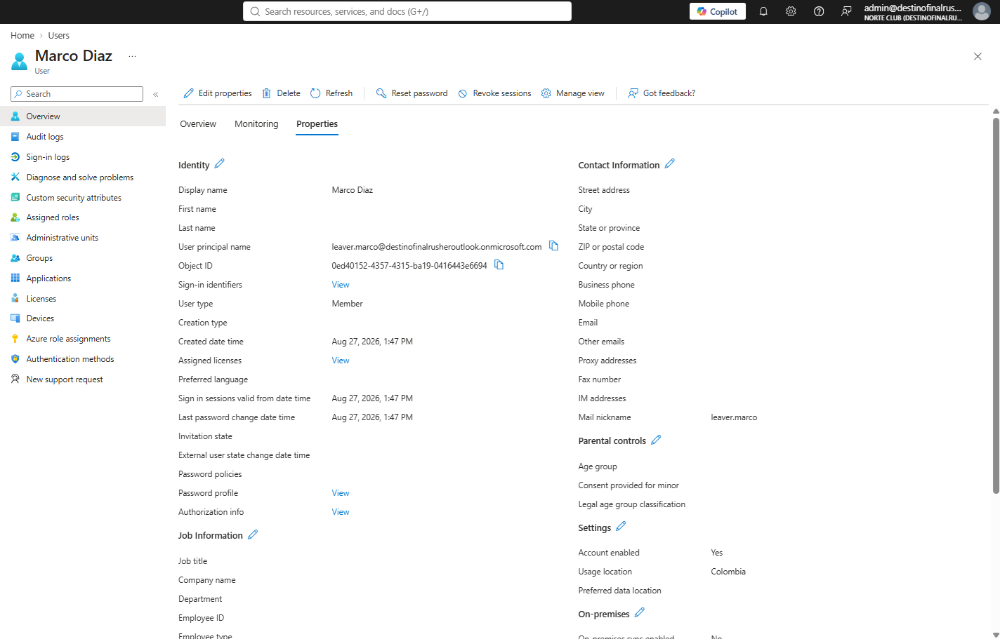
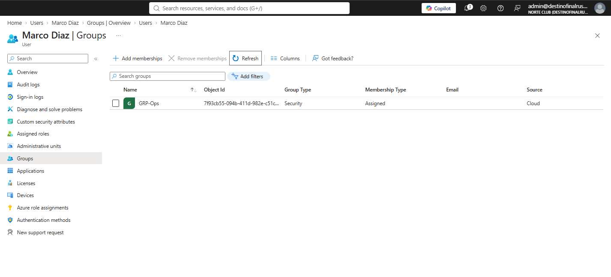
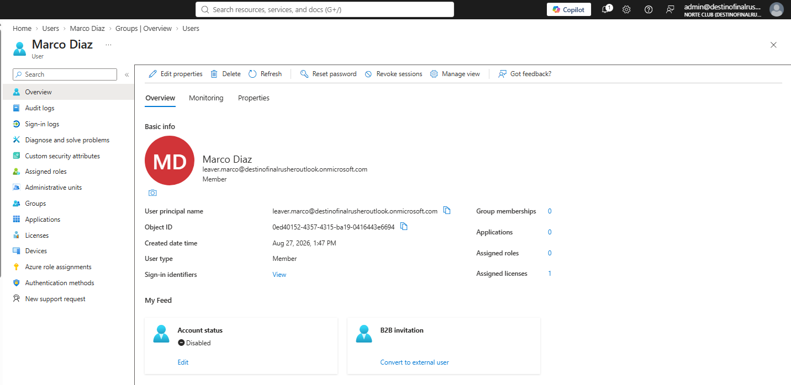
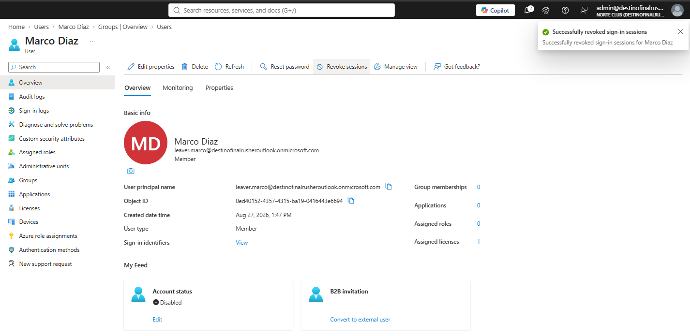
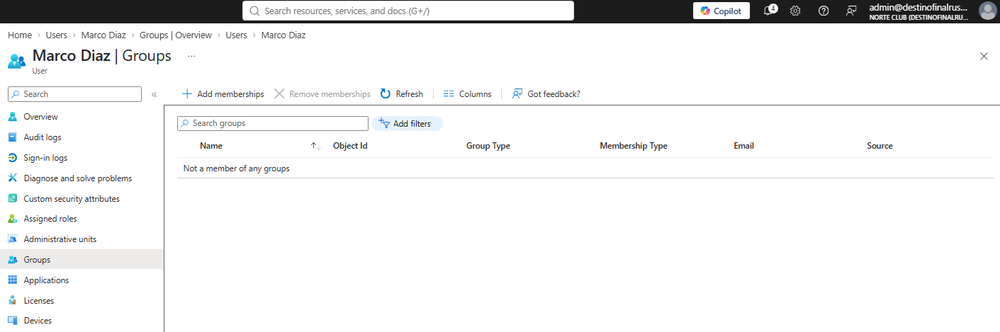

# NC-012 leaver.marco

Date: 31 Aug 2026
Requester: HR offboard for Marco Diaz
Requested action: disable account, revoke sessions, confirm groups empty
Verification: I control leaver.marco@destinofinalrusheroutlook.onmicrosoft.com in this tenant

## Before

- Display name: Marco Diaz
- UPN: leaver.marco@destinofinalrusheroutlook.onmicrosoft.com
- Account enabled: Yes
- Group memberships: none
- Sign-ins: none. Account never used.

## After

- Account status: Disabled
- Sessions revoked
- Groups: still none
- Account not deleted

## Rollback

Properties → Account enabled = Yes. Sessions stay revoked until he signs in again.

Blades: Users > Marco Diaz > Properties, Groups. Revoke sessions.

helpdesk.t1 did not perform this. No standing role on T1.
