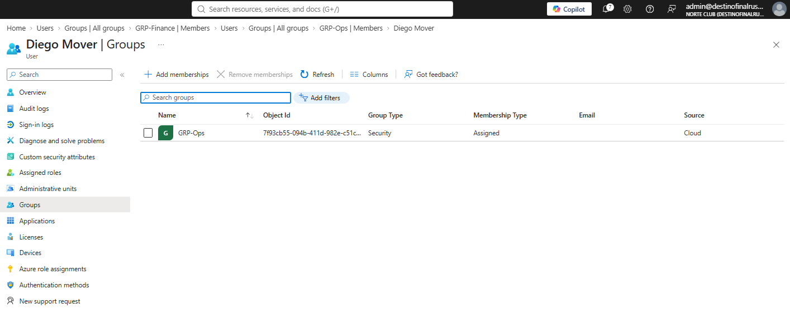
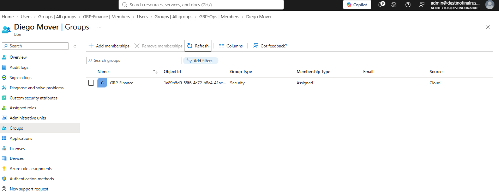

# NC-013 mover diego

Date: 1 Sep 2026
Requester: Norte Club HR (lab)
Requested action: move mover.diego from Ops to Finance. App grant follows GRP-Ops, so he loses nc-timeclock
Verification: I own mover.diego. Ticket before any group change.

## Decision

Direct group membership. Not an access package request. Not a role. Remove first, then add. Do not leave him in both.

## Before

Diego Mover groups: GRP-Ops only.

## After

Diego Mover groups: GRP-Finance only. Luis stays in Ops. Ana stays in Finance.

nc-timeclock assignment required remains GRP-Ops. Diego is not assigned as a user. He should not see the app.

## Rollback

Remove GRP-Finance. Add GRP-Ops. Same two clicks.

Blades: Users > Diego Mover > Groups. Enterprise applications > nc-timeclock > Users and groups if you need the app story.
