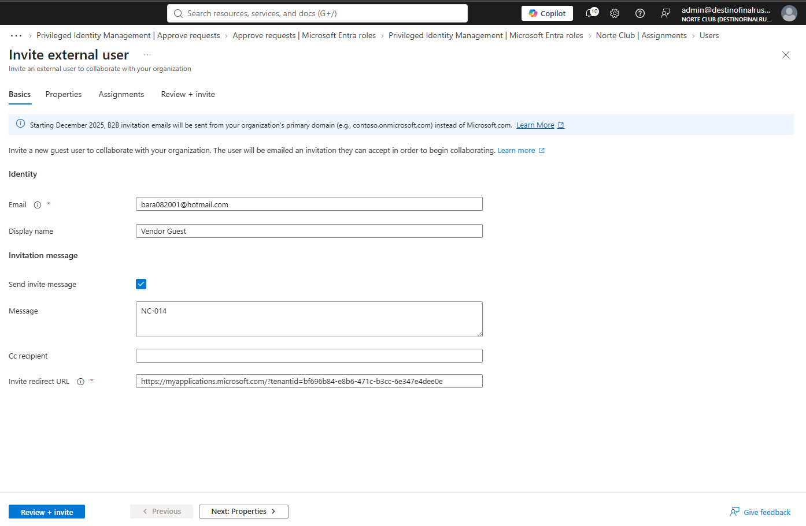
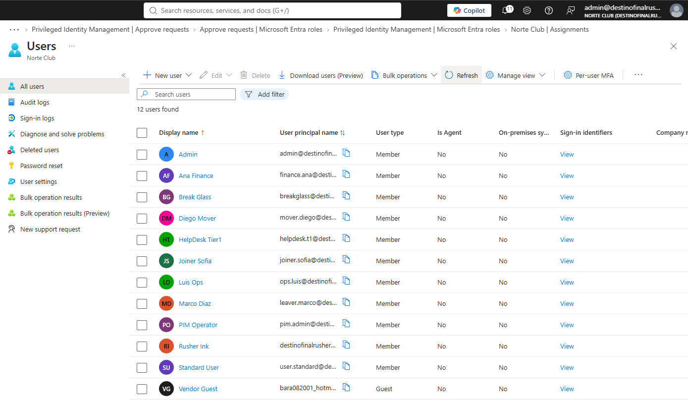

# NC-014 guest vendor

Date: 1 Sep 2026
Requester: Norte Club ops (lab)
Requested action: invite one B2B guest. No groups. No roles.
Verification: inbox is off-tenant. I can open it.

## Decision

Invite only. Not a second tenant. Not cross-tenant access settings. Not Entitlement for guests. Pending or redeemed both count. Groups stay empty so the guest cannot open nc-timeclock.

## After

Vendor Guest. User type Guest. No directory role. No GRP-RA-Helpdesk. No GRP-Ops.

## Rollback

Delete the guest user. Do not block the entire domain.

Blade: Users > New user > Invite external user.
