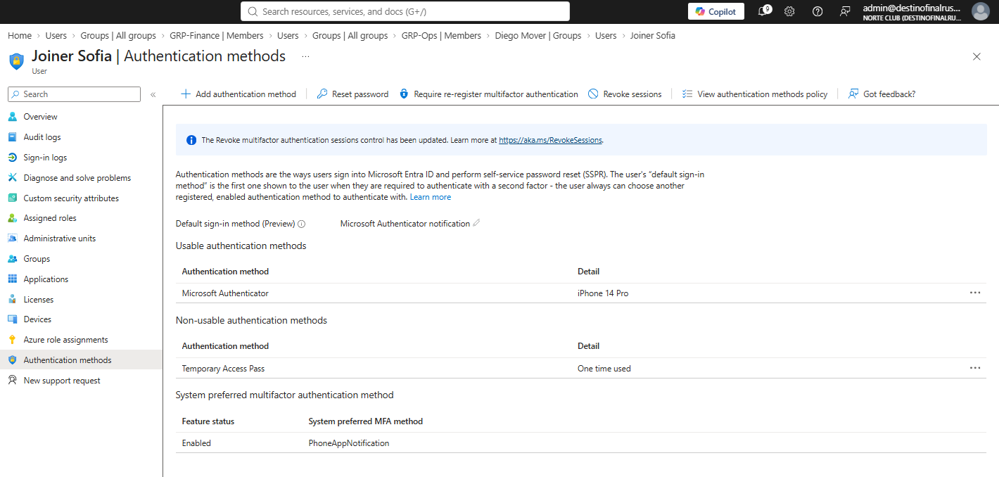
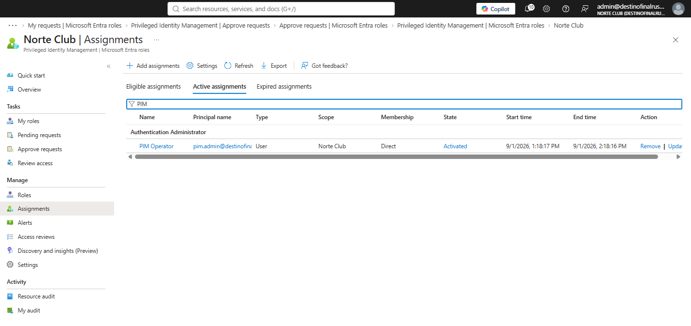
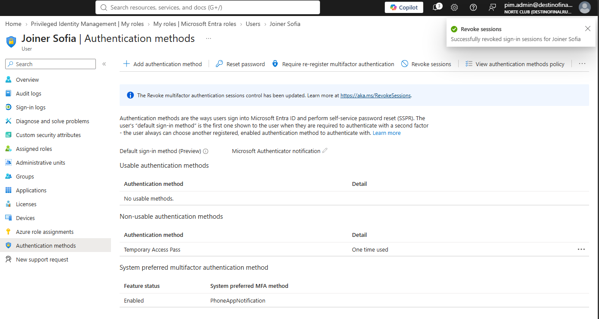

# NC-015 MFA wipe via PIM

Date: 1 Sep 2026
Requester: Norte Club ops (lab)
Requested action: wipe joiner.sofia MFA while pim.admin is elevated Authentication Administrator. Then drop the role.
Verification: I own joiner.sofia. admin approves. Justification NC-015.

## Decision

Same role as NC-005. Wipe is the work the role exists for. Do not wipe from standing GA. Do not use helpdesk.t1 on this ticket. Recover is out of scope here.

## Before

Usable method: Microsoft Authenticator, iPhone 14 Pro.

## During

pim.admin Authentication Administrator Activated 1 Sep 2026 1:18 PM–2:18 PM. admin approved.

Wipe and revoke ran in the pim.admin session.

## After

Usable methods: none. TAP already consumed. Sessions revoked.

Role deactivated after the wipe. Eligible assignment remains. No standing Auth Admin on pim.admin.

## Rollback

Issue TAP to joiner.sofia and register Authenticator again. Same as NC-004. Do not re-activate Auth Admin to recover a phone.

Blades: PIM My roles / Approve requests. Users > Joiner Sofia > Authentication methods.
